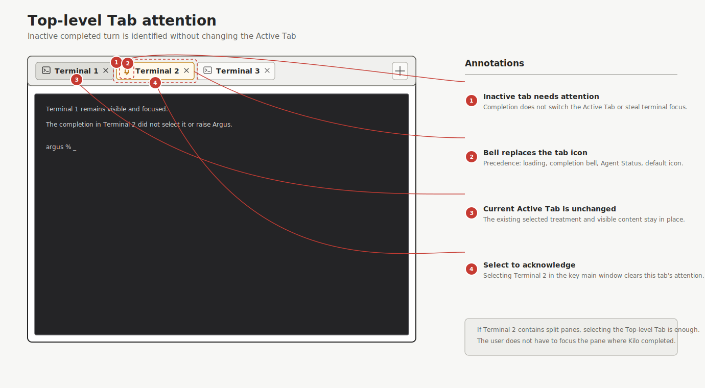
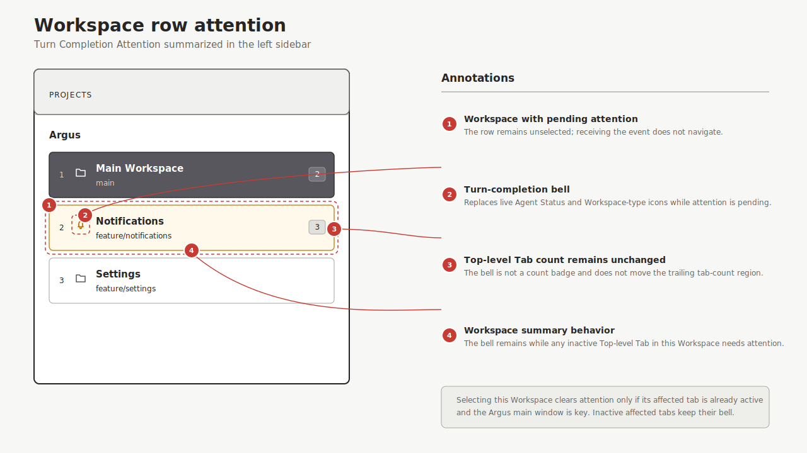
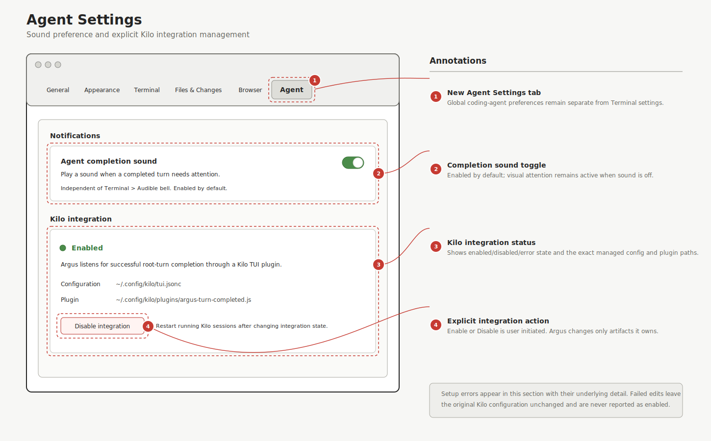

# Turn-completed notification

## Status

- Lifecycle: Accepted
- Implementation: Not started
- Last reviewed: 2026-07-23
- Stable-contract target: `docs/SPEC.md`

This proposal does not describe current v1 behavior. When implementation and verification are complete, promote the shipped behavior into `docs/SPEC.md` and mark this proposal Implemented or Superseded.

## Summary

Argus will notify the user when a Kilo coding-agent turn completes in a Terminal Panel that is not currently visible. The affected Top-level Tab will show a bell icon, and its Workspace row in the left sidebar will show the same icon. Selecting the affected tab clears its attention state.

Argus will also play a completion sound unless the sound preference is disabled. A completion that is already visible does not create attention and does not play a sound.

The first integration supports Kilo only. The Argus-side protocol remains agent-agnostic so another coding agent can report the same semantic event later without adding agent-specific behavior to the Argus Application.

## Goals

- Make it clear which Workspace needs attention.
- Identify the exact Top-level Tab where the completed turn ran.
- Avoid alerts for sub-agent completions.
- Avoid alerts when the user is already viewing the completed turn.
- Keep coding-agent completion sound separate from the Terminal audible bell.
- Integrate with Kilo through its public extension points only.
- Leave room for future coding-agent integrations without generalizing beyond a turn-completed event.

## Non-goals

This proposal does not add:

- notifications for failed or interrupted turns;
- notifications for permission prompts or Kilo questions;
- notifications for idle, retry, or offline transitions;
- notifications for sub-agent turns;
- live Agent Status updates;
- agent PID registration or stale-process sweeping;
- text-to-speech announcements;
- macOS Notification Center notifications;
- notification history, counts, or an inbox;
- persistent unread attention across Argus restarts;
- support for coding agents other than Kilo;
- changes to Kilo source code.

This proposal intentionally limits the first external integration to successful turn completion. The broader behaviors above remain out of scope unless they receive separate proposals. The application spec must be updated with the behavior actually shipped when this proposal is implemented.

## Terminology

### Turn Completion Event

An agent-agnostic IPC event stating that one coding-agent turn completed successfully. It identifies the Agent Key, Workspace ID, and Terminal Surface that originated the event.

### Turn Completion Attention

Ephemeral Argus Application state indicating that the result of a Turn Completion Event has not yet been viewed. Attention belongs to the Top-level Tab containing the reported Terminal Surface.

### Viewed

A Top-level Tab is viewed only when all of the following are true:

- its Workspace is the Selected Workspace;
- it is the Active Tab in that Workspace; and
- the Argus main window is key.

All panes in a split Top-level Tab are considered visible together. The user does not have to focus the exact Terminal Pane that reported completion.

## User experience

### Receiving a completion

When Argus receives a qualifying Turn Completion Event:

1. It resolves the Workspace ID and Surface ID against current runtime state.
2. It finds the Top-level Tab whose split layout contains that Terminal Surface.
3. It checks whether that tab is viewed.
4. If the tab is viewed, Argus does not retain attention and does not play a sound.
5. Otherwise, Argus marks the Top-level Tab as needing attention and plays the completion sound when enabled.

Receiving a completion must not select a Workspace, activate a tab, focus a pane, activate Argus, raise its window, or otherwise interrupt the user's current work.

Events with an unknown Workspace ID, an unknown Surface ID, or a Surface ID that does not belong to the supplied Workspace ID are rejected or ignored without changing UI state.

### Top-level Tab indicator

A Top-level Tab with pending Turn Completion Attention replaces its normal icon with a bell icon.



Tab icon precedence is:

1. loading spinner;
2. Turn Completion Attention bell;
3. live Agent Status icon;
4. default tab icon.

The indicator must have an accessibility value such as "Agent turn completed". Color must not be the only indication. The tab's geometry must remain stable when the icon changes.

### Workspace indicator

A Workspace row shows the same bell icon when any Top-level Tab in that Workspace has pending Turn Completion Attention.



Workspace icon precedence is:

1. Turn Completion Attention bell;
2. live Agent Status icon;
3. default Workspace-type icon.

The Workspace row is a summary only. Selecting a Workspace does not clear attention from its inactive tabs.

### Clearing attention

Turn Completion Attention for one Top-level Tab clears when that tab becomes viewed. This includes:

- selecting the affected tab while its Workspace is selected and the Argus window is key;
- selecting its Workspace when the affected tab is already active and the Argus window is key; or
- activating the Argus window when the affected tab is already active in the Selected Workspace.

Selecting a different tab in the affected Workspace does not clear attention. Focusing a different pane within the affected Top-level Tab does clear it because all panes in the tab are visible together.

If a completion arrives while the tab is already viewed, there is no visible flash, retained bell, or sound.

Closing a Top-level Tab discards its pending attention. Closing a Workspace discards attention for all of its tabs.

### Repeated completions

Repeated qualifying completions in the same unviewed Top-level Tab collapse into one attention state. The UI does not show a count and Argus does not retain event history.

Each qualifying completion may play the sound while the tab remains unviewed. The attention state itself remains one bell. A short sound rate limit may be added to prevent overlapping playback, but it must not delay or debounce event acceptance.

### Restart behavior

Turn Completion Attention is runtime-only. It is not part of the Session Snapshot and does not survive an Argus restart.

## Sound preference

Settings will include an Agent section with an "Agent completion sound" toggle.



- The preference is enabled by default.
- It is stored as a global application preference in `UserDefaults`.
- It is independent of Terminal > Audible bell.
- Disabling sound does not disable visual attention.
- Argus uses one fixed, restrained completion sound in the first version. Sound selection and volume controls are out of scope.
- Sound playback is fire-and-forget. Playback failure does not affect attention state or IPC success.

## Kilo integration

### Extension-only constraint

Argus must not change Kilo source code. The integration must use Kilo's public TUI plugin API and public lifecycle events.

The plugin is inert unless all of these inherited environment variables are present and valid:

- `ARGUS_SOCKET_PATH`
- `ARGUS_WORKSPACE_ID`
- `ARGUS_SURFACE_ID`

Kilo launched from an Argus Terminal Panel inherits these variables. Kilo launched elsewhere does not activate the integration.

### Exact lifecycle signals

The plugin uses `session.turn.close` as the terminal signal. A candidate completion must satisfy:

- `reason === "completed"`; and
- `parentID` is absent.

These checks reliably exclude failed or interrupted turns and child/sub-agent sessions. The plugin must not use `session.status: idle` or the deprecated `session.idle` event as completion signals because an idle session may resume.

### User-action provenance limitation

Kilo's public `session.turn.open` and `session.turn.close` events do not identify what initiated a turn. A root completion can follow a human prompt, direct API prompt, compaction, plan follow-up, or another generated continuation. The public message schema also has no authoritative human-action provenance field.

Because Kilo source changes are forbidden, the first integration cannot prove the requirement "only in response to a user action" for every event. It will enforce the closest conservative rule available through extension points:

- observe user-role message and part events for the root session;
- reject turns associated with a compaction part;
- reject turns associated with text marked `synthetic: true`;
- require busy or retry activity before accepting `session.turn.close`;
- accept only successful root-session closes;
- deduplicate accepted closes by Kilo event ID and session turn state.

This filter suppresses known automatic compaction and synthetic background-result paths. It cannot distinguish a human prompt from a programmatic prompt that Kilo represents as an ordinary, non-synthetic user message. That is a known false-positive boundary, not a reason to add timing heuristics or modify Kilo internals.

The plugin must not delay completion for the old three-second idle debounce. `session.turn.close` is the completion boundary; the provenance filter and root-session check decide eligibility.

### Plugin state

The plugin keeps process-local state per Kilo session. At minimum it tracks:

- whether a root turn is active;
- whether busy or retry activity occurred;
- whether the candidate user message is known synthetic or compaction-generated;
- event IDs already submitted; and
- whether the current close has already been handled.

The plugin sends at most one Turn Completion Event for one accepted close event. Socket failures are silent and must not interfere with Kilo.

### Installation and activation

Argus Settings will include a Kilo integration section with status and explicit Enable/Disable controls.

Enable performs these operations:

1. Copy the Argus-owned TUI plugin into a clearly named location under Kilo's global config directory, normally `~/.config/kilo/` or the effective Kilo config directory when an environment override applies.
2. Add one Argus-owned local plugin entry to the effective global `tui.jsonc` or `tui.json`.
3. Preserve unrelated plugin entries, settings, ordering where practical, formatting, and JSONC comments.
4. Validate the resulting configuration before reporting success.
5. Explain that running Kilo sessions must be restarted before the integration loads.

Disable removes only the Argus-owned plugin declaration and plugin file. It must not alter unrelated Kilo settings or plugin enablement state.

Argus must use locked, atomic, structural JSON/JSONC edits. It must not rewrite the configuration through a plain JSON serializer or use string replacement. Parse, permission, lock, validation, or write failures leave the original configuration unchanged and are shown in Settings with the underlying error.

If both `tui.jsonc` and `tui.json` exist or configuration resolution is otherwise ambiguous, Argus must follow Kilo's documented global precedence and show the exact file it manages. It must not create a competing config file as a fallback after an edit failure.

Argus owns only:

- its installed plugin file;
- its exact plugin declaration; and
- any integration metadata needed to identify those artifacts safely.

The first version does not silently install or repair the integration at application launch. Updates may refresh the Argus-owned plugin file after the user has enabled the integration, but must not broaden Argus's ownership of Kilo configuration.

## Agent-agnostic IPC

### Transport

The Argus Application hosts a Unix Domain Socket at the path injected as `ARGUS_SOCKET_PATH`. Requests and responses use newline-delimited JSON. Receiving a request must not activate the app or mutate focus.

The first implementation may include only the socket infrastructure and method required for Turn Completion Events. It does not need to implement unrelated Companion CLI commands or the broader draft agent subsystem.

### Request

The wire contract is versioned and uses an agent-neutral method name. A representative request is:

```json
{
  "version": 1,
  "id": "01J...",
  "method": "agent.turnCompleted",
  "params": {
    "agentKey": "kilo",
    "workspaceId": "6B1DBEA5-0F62-4FD0-AE7B-A82742BB52B5",
    "surfaceId": "45D4FF7B-2A46-423A-94B4-F7332E46268C",
    "eventId": "kilo-event-id"
  }
}
```

Fields:

- `version` is the socket protocol version.
- `id` is an optional Request ID used only for request/response correlation.
- `method` is `agent.turnCompleted`.
- `agentKey` is an unrestricted integration identifier. The Kilo plugin uses `kilo`.
- `workspaceId` identifies the Workspace that supplied the integration environment.
- `surfaceId` identifies the Terminal Surface where Kilo runs.
- `eventId` is an integration-provided identifier used for process-lifetime deduplication.

Kilo-specific fields such as session ID, parent ID, status, or close reason are not part of the Argus method. The Kilo plugin owns the translation from Kilo lifecycle events to this semantic request.

### Response

A successful request receives a small correlated response. Success means the event was valid and accepted or was an idempotent duplicate; it does not promise that sound playback succeeded.

Errors use a structured code and message. Invalid JSON, unsupported protocol versions, unknown methods, malformed UUIDs, and mismatched Workspace/Surface ownership must not mutate attention state.

### Security and validation

The socket is local to the user account and must use restrictive filesystem permissions. Argus still validates every request and applies bounded frame sizes before decoding JSON.

The Workspace ID and Surface ID must resolve to a current Terminal Panel relationship. The socket payload must never be able to create arbitrary Workspace or Panel state.

## Argus runtime design

### Ownership

A process-wide Turn Completion Attention store owns ephemeral attention state. It is separate from `AgentStatusStore` because an Agent Status Entry describes current telemetry while Turn Completion Attention records an unseen event.

The store should expose operations to:

- record an accepted event for a Workspace and Surface;
- resolve whether a Top-level Tab or Workspace has attention;
- clear attention for a viewed Top-level Tab;
- remove attention when tabs or Workspaces close; and
- clear all runtime attention.

Views read the store but do not infer or own acknowledgment state. Workspace and tab selection/window-activation paths tell the store when a tab becomes viewed.

### Top-level Tab resolution

A Turn Completion Event is scoped to a Terminal Surface, but attention is displayed and acknowledged at Top-level Tab scope. Argus resolves the current split layout containing the Surface ID at event time and stores the Top-level Tab's root Panel ID.

If a pane is later moved within the same Top-level Tab, attention remains with that tab. If model operations ever move a pane between Top-level Tabs, they must either move or discard its pending attention explicitly; current scope does not add such an operation.

### Window activation

The AppKit main-window key-state lifecycle participates in acknowledgment. When the main window becomes key, Argus checks the Selected Workspace's Active Tab and clears its attention if present. Auxiliary Settings, sheets, or alerts becoming key do not count as viewing a Workspace tab.

## Accessibility

- The bell must use a semantic SF Symbol and an accessibility value naming the completed agent turn.
- Workspace accessibility should report that one or more tabs need attention.
- Tab accessibility should report attention on the affected tab.
- Color must not be the only signal.
- Icon replacement must not change row or tab layout.
- Receiving IPC events must not move accessibility focus.

## Failure behavior

- Kilo continues normally if the plugin cannot connect to Argus.
- Argus ignores stale events whose Workspace or Surface no longer exists.
- Malformed or unauthorized socket input cannot mutate UI state.
- Sound failure leaves the visual bell intact.
- Plugin installation failure leaves existing Kilo configuration and plugin files unchanged where atomicity permits.
- An Argus configuration error is visible in Settings; runtime event-delivery errors remain silent in Kilo.

## Verification

The implementation should add the smallest set of tests that establish the behavior at stable boundaries.

### Attention store tests

Cover:

- Surface-to-Top-level-Tab resolution, including split panes;
- one attention state for repeated events in one tab;
- independent attention in multiple tabs and Workspaces;
- Workspace summary behavior;
- tab-scoped clearing;
- cleanup when a tab or Workspace closes; and
- no persistence in Session Snapshot state.

### Visibility tests

Cover these cases:

| Event context | Bell | Sound |
|---|---:|---:|
| Affected tab viewed in key main window | No | No |
| Affected tab active but Argus main window not key | Yes | Yes when enabled |
| Different tab active in Selected Workspace | Yes | Yes when enabled |
| Different Workspace selected | Yes | Yes when enabled |
| Sound disabled and affected tab not viewed | Yes | No |

Also verify that selecting only the Workspace does not clear attention from an inactive affected tab, and that activating the main window clears attention when the affected tab is already active.

### UI contract tests

Verify icon precedence and accessibility for Workspace rows and Top-level Tabs:

- loading > completion attention > Agent Status > default tab icon;
- completion attention > Agent Status > default Workspace icon; and
- no focus or selection mutation when an event arrives.

### Socket tests

Use the real local socket boundary where practical. Cover valid delivery, idempotent duplicate delivery, malformed frames, unsupported versions, unknown methods, frame-size limits, unknown IDs, and Workspace/Surface mismatch.

### Kilo plugin tests

Using public plugin event shapes, cover:

- successful root completion is submitted once;
- child completion is ignored;
- error and interruption are ignored;
- idle alone is ignored;
- known synthetic and compaction-generated turns are ignored;
- absent Argus environment disables the plugin; and
- socket failure does not reject or interrupt Kilo event handling.

The test suite must document that an ordinary programmatic, non-synthetic user message is indistinguishable from a human prompt through current Kilo extension points.

### Integration setup tests

Cover JSON and JSONC configuration with comments, existing plugin entries, repeated Enable, Disable, parse failure, lock/write failure, and rollback behavior. Verify that only Argus-owned files and config entries change.

## Acceptance criteria

The proposal is complete when all of the following are true:

- A qualifying Kilo root-turn completion in an unviewed Terminal tab displays a bell on that Top-level Tab and its Workspace row.
- No child-session completion creates attention.
- Known synthetic or compaction-driven root turns do not create attention.
- A completion already viewed in the key Argus main window creates neither attention nor sound.
- Viewing the affected Top-level Tab clears its bell and clears the Workspace bell when no other tab needs attention.
- The completion sound is enabled by default and can be disabled independently of the Terminal audible bell.
- Receiving a completion never changes Workspace selection, tab selection, pane focus, application activation, or accessibility focus.
- Attention is discarded when its tab or Workspace closes and does not survive restart.
- Kilo integration is installed only through an explicit Settings action and only through public Kilo extension points.
- Kilo source code is unchanged.
- Argus preserves unrelated Kilo configuration and reports setup failures without leaving a partially rewritten config.
- The socket method is agent-agnostic and contains no Kilo lifecycle details.

## Known limitation

The Kilo extension API can identify successful root-session completion and known generated messages, but it cannot authoritatively prove that every accepted root turn began with a human action. Until Kilo exposes turn provenance through a public extension event, the integration provides conservative best-effort filtering and documents this boundary in tests and Settings help text.
